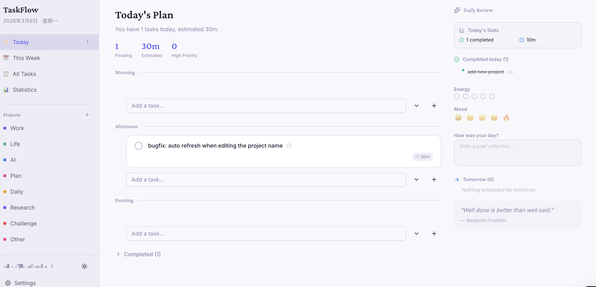

# TaskFlow

一款个人任务管理应用，UI 风格平静，灵感来自 Sunsama。基于 Next.js 15 构建，支持按开始日期控制任务可见性、时间块每日规划，以及单用户自托管部署。



<!-- TODO: 在此添加演示 GIF -->

## 在线演示

在您部署的 URL 上试用 — 开放注册（限 50 个名额，先到先得）。

## 功能特性

- **每日计划** — 上午 / 下午 / 晚上 / 未安排 时间块，支持拖拽排序
- **周视图** — 7 天日历，支持跨天拖拽调度
- **项目与标签** — 按项目（颜色标识）和标签组织任务
- **优先级系统** — 5 个等级（紧急 / 高 / 中 / 低 / 无），带有视觉指示器
- **每日回顾** — 追踪精力、情绪并写下反思
- **统计数据** — 完成趋势、情绪/精力图表
- **开始日期可见性** — 任务在开始日期到来之前保持隐藏
- **数据导出/导入** — 在设置页面完整备份和还原 JSON 数据
- **深色/浅色主题** — 通过侧边栏切换
- **MCP 服务器** — 17 个工具，供 Claude Code 集成使用（任务增删改查、AI 任务拆分、每日安排）

## 技术栈

- **框架**: Next.js 15（App Router、Server Actions、Turbopack）
- **UI**: Tailwind CSS v4 + shadcn/ui + Lucide Icons
- **数据库**: Drizzle ORM + PostgreSQL（Neon serverless）
- **认证**: Auth.js v5（Credentials、JWT）
- **验证**: Zod
- **拖拽**: dnd-kit

## 架构决策

| 决策 | 原因 |
|------|------|
| **Server Actions 替代 REST** | 自动 CSRF 防护、集成缓存失效、更少样板代码 |
| **分数索引** | `position: real` 实现 O(1) 拖拽排序，无需重新编号相邻项 |
| **startDate 可见性** | 任务在开始日期前对今日视图隐藏 — 降低认知负担 |
| **软删除** | 使用 `deletedAt` 时间戳而非硬删除 — 用户数据永不丢失 |
| **JWT 会话** | 单用户应用无需数据库会话表 — 更简单、查询更少 |
| **Neon HTTP 驱动** | `@neondatabase/serverless` 在 serverless 环境中提供可靠连接 |

## 快速开始

### 前置条件

- Node.js 18+
- PostgreSQL 数据库（本地或 [Neon](https://neon.tech)）

### 安装步骤

```bash
# 克隆仓库
git clone https://github.com/WeiS49/TaskFlow.git
cd taskflow

# 安装依赖
npm install

# 配置环境变量
cp .env.example .env
# 编辑 .env，填入您的 DATABASE_URL 并生成 AUTH_SECRET：
#   openssl rand -base64 32

# 推送 schema 到数据库
npx drizzle-kit push

# 初始化管理员用户
npx tsx src/db/seed.ts

# 启动开发服务器
npm run dev
```

打开 [http://localhost:3000](http://localhost:3000)，使用 `.env` 文件中的凭据登录。

### MCP 服务器（可选）

MCP 服务器允许 Claude Code 直接管理您的任务。

```bash
cd mcp-server
npm install
npm run build
```

添加到您的 `.mcp.json`：

```json
{
  "mcpServers": {
    "taskflow": {
      "type": "stdio",
      "command": "node",
      "args": ["<path-to>/mcp-server/dist/index.js"],
      "env": {
        "DATABASE_URL": "your-database-url"
      }
    }
  }
}
```

## 常用命令

```bash
npm run dev          # 开发服务器（Turbopack）
npm run build        # 生产构建
npm run lint         # ESLint 检查
npx tsc --noEmit     # 类型检查
npx drizzle-kit push # 推送 schema 到数据库
```

## 许可证

MIT
